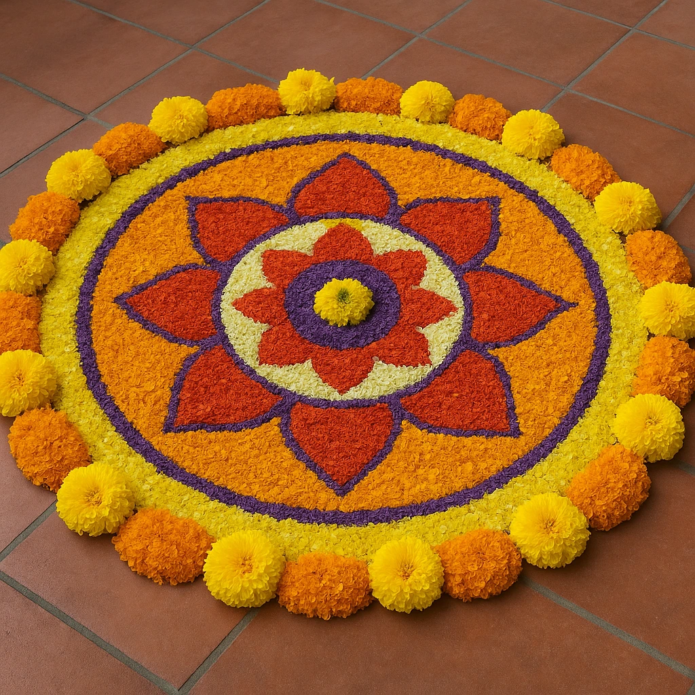
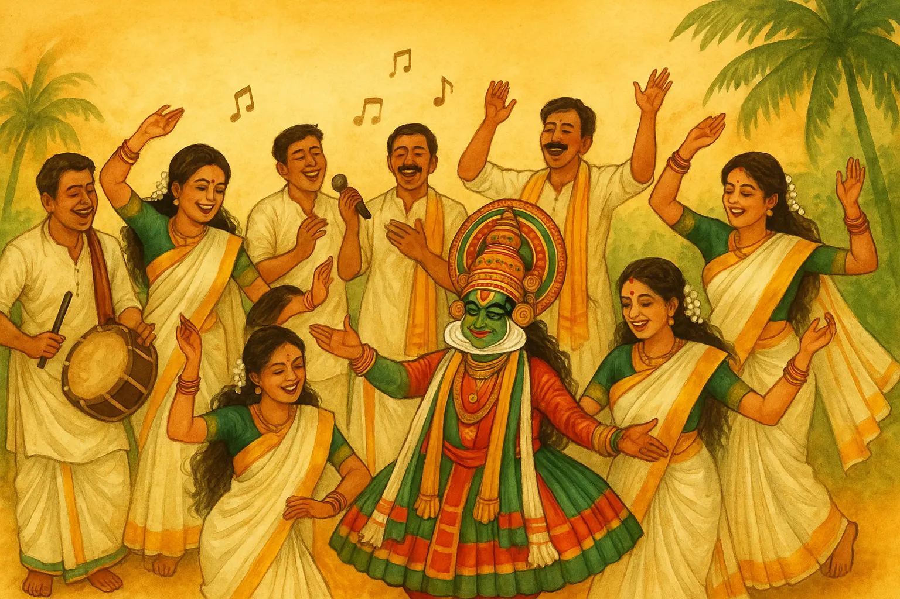
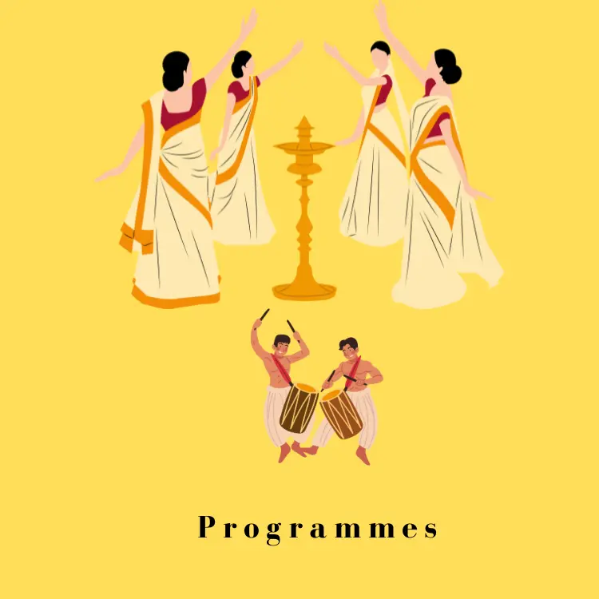

```{=html}
<div class="banner-wrap">
  
</div>

<style>
  .banner-wrap{
    max-width:1100px;
    margin:0 auto 1em;
    padding:0 14px;
  }
  .banner-wrap img{
    display:block;
    width:100%;
    height:auto;            /* show full banner, no cropping */
    object-fit:contain;
    border-radius:14px;
    box-shadow:0 8px 24px rgba(0,0,0,.10);
  }
</style>
```

```{=html}
<!-- Onam welcome marquee (HTML-only block for Quarto) -->
<div class="onam-marquee" role="region" aria-label="Onam welcome">
  <div class="onam-track">
    <span>🌼കോളേജ് ഓഫ് അഗ്രികൾച്ചർ വെള്ളായണി സംഘടിപ്പിക്കുന്ന സംയുക്ത ഓണാഘോഷ പരിപാടിയിലേക് സ്വാഗതം 🌼</span>
    <span aria-hidden="true">🌼കോളേജ് ഓഫ് അഗ്രികൾച്ചർ വെള്ളായണി സംഘടിപ്പിക്കുന്ന സംയുക്ത ഓണാഘോഷ പരിപാടിയിലേക് സ്വാഗതം  </span>
  </div>
</div>

<style>
  .onam-marquee{
    overflow:hidden;
    border-radius:12px;
    border:1px solid #e7e7e7;
    background:
      radial-gradient(600px 200px at 85% -20%, #fffbe6 0%, transparent 60%),
      linear-gradient(90deg,#fffdf4,#fff);
    box-shadow:0 8px 24px rgba(0,0,0,.06);
  }
  .onam-track{
    display:flex;
    gap:3rem;
    white-space:nowrap;
    will-change: transform;
    animation:onam-scroll 5s linear infinite;
    padding:.85rem 1rem;
    font-family: "Noto Sans Malayalam", system-ui, -apple-system, "Segoe UI", Roboto, Arial, "Noto Sans", sans-serif;
    font-weight:700;
    font-size:clamp(1rem, 2.4vw, 1.35rem);
    color:#1a5c2a;
  }
  .onam-track:hover{ animation-play-state: paused; } /* pause on hover */
  @keyframes onam-scroll{
    from{ transform: translateX(0); }
    to  { transform: translateX(-50%); } /* duplicate text for seamless loop */
  }
</style>
```

```{=html}
<!-- Event highlights -->
<div class="oh-info">
  <div class="oh-title">🌼 ഓണാഘോഷം 2026 🌼</div>
  <div class="oh-chips">
    <span class="oh-chip">📅 21/08/2026</span>
    <span class="oh-chip">⏰ രാവിലെ 8:00 മുതൽ</span>
    <span class="oh-chip">📍 Indoor Stadium</span>
  </div>

  <div class="oh-note">
    📍 <strong>അത്തപ്പൂക്കള മത്സരം</strong> — 21/08/2026 രാവിലെ 8:00 മുതൽ 11:00 വരെ.
    രജിസ്ട്രേഷൻ <strong>19/08/2026 വൈകുന്നേരം 3:00 മണിക്ക് മുമ്പ്</strong> പൂർത്തിയാക്കണം.
  </div>
  <div class="oh-note">
    🎭 <strong>കലാപരിപാടികളുടെ രജിസ്ട്രേഷൻ</strong> (സ്റ്റാഫ്, അധ്യാപകർ, വിദ്യാർത്ഥികൾ)
    <strong>19/08/2026 വൈകുന്നേരം 3:00 മണിക്ക് മുമ്പ്</strong> പൂർത്തിയാക്കണം.
  </div>
</div>

<style>
  .oh-info{
    max-width:760px; margin:26px auto 6px; padding:0 14px;
    font-family:"Inter",system-ui,-apple-system,"Segoe UI",Roboto,Arial,sans-serif;
  }
  .oh-title{
    text-align:center; font-size:1.6rem; font-weight:800; color:#b36b00; margin:6px 0 12px;
  }
  .oh-chips{ display:flex; flex-wrap:wrap; gap:8px; justify-content:center; margin-bottom:14px; }
  .oh-chip{
    background:#fff3e6; color:#8a5200; border:1px solid #f0d9bd;
    padding:7px 14px; border-radius:999px; font-weight:600; font-size:.92rem;
  }
  .oh-note{
    border-left:6px solid #b36b00; background:#fff3e6; border-radius:10px;
    padding:12px 14px; margin:10px 0; line-height:1.55; font-size:.97rem; color:#3a2a10;
  }
  .oh-note strong{ color:#8a5200; }
</style>
```

```{=html}
<!-- BIG Programme & Rules button -->
<div class="rules-cta-wrap">
  <a class="rules-cta" href="onamrules.html" aria-label="Programme list and rules">
    <span class="rules-cta-emoji">📜</span>
    <span class="rules-cta-text">
      <span class="rules-cta-main">മത്സര ഇനങ്ങളും നിബന്ധനകളും</span>
      <span class="rules-cta-sub">Full Programme List &amp; Rules — ഇവിടെ ക്ലിക്ക് ചെയ്യുക</span>
    </span>
    <span class="rules-cta-arrow">→</span>
  </a>
</div>

<style>
  .rules-cta-wrap{ max-width:760px; margin:22px auto; padding:0 14px; }
  .rules-cta{
    display:flex; align-items:center; gap:14px;
    padding:20px 22px;
    border-radius:18px;
    text-decoration:none;
    color:#fff;
    background:linear-gradient(135deg,#e68a00,#b36b00);
    box-shadow:0 10px 26px rgba(179,107,0,.35);
    transition:transform .2s ease, box-shadow .2s ease;
  }
  .rules-cta:hover,.rules-cta:focus{
    transform:translateY(-3px);
    box-shadow:0 14px 32px rgba(179,107,0,.5);
  }
  .rules-cta-emoji{ font-size:2.2rem; line-height:1; }
  .rules-cta-text{ display:flex; flex-direction:column; flex:1; }
  .rules-cta-main{ font-size:1.25rem; font-weight:800; line-height:1.3; }
  .rules-cta-sub{ font-size:.92rem; opacity:.95; margin-top:3px; }
  .rules-cta-arrow{ font-size:1.8rem; font-weight:700; }

  @media (max-width:600px){
    .rules-cta{ padding:16px 16px; gap:10px; }
    .rules-cta-emoji{ font-size:1.8rem; }
    .rules-cta-main{ font-size:1.05rem; }
    .rules-cta-sub{ font-size:.82rem; }
  }
</style>
```

👉 പൂക്കളവും കലാപരിപാടികളും രജിസ്റ്റർ ചെയ്യാൻ താഴെ ക്ലിക്ക് ചെയ്യുക 👇

```{=html}
<div class="pookalam-container">
  <!-- Pookalam Registration -->
  <a class="pookalam-card" href="pookalamreg.html" aria-label="Pookkalam registration">
    <picture>
      <source srcset="www/pookalam.webp" type="image/webp">
      
    </picture>
    <span class="pookalam-badge">Pookalam Registration</span>
  </a>

  <!-- Cultural Programme Registration -->
  <a class="pookalam-card" href="culturalreg.html" aria-label="Cultural programme registration">
    <picture>
      <source srcset="www/cultural.webp" type="image/webp">
      
    </picture>
    <span class="pookalam-badge">Cultural Registration</span>
  </a>

  <!-- General Registration -->
  <a class="pookalam-card" href="onamrules.html" aria-label="Programme list and rules">
    <picture>
      <source srcset="www/programmes.webp" type="image/webp">
      
    </picture>
    <span class="pookalam-badge">Programme List &amp; Rules</span>
  </a>
</div>

<style>
  :root{
    --sb-ink:#1b1b1b;
    --sb-brand:#6b46c1;
    --sb-ink-on:#ffffff;
    --sb-card:#ffffff;
    --sb-shadow:0 10px 30px rgba(0,0,0,.12);
    --sb-radius:16px;
  }

  /* layout container */
  .pookalam-container{
    display:grid;
    grid-template-columns: repeat(auto-fit, minmax(280px, 1fr));
    gap:20px;
    justify-items:center;
    margin:30px auto;
    max-width:1100px;
    padding:0 14px;
  }

  .pookalam-card{
    position:relative;
    display:block;
    width:100%;
    max-width:340px;
    border-radius:var(--sb-radius);
    overflow:hidden;
    text-decoration:none;
    background:var(--sb-card);
    box-shadow:var(--sb-shadow);
    aspect-ratio: 16/10;
  }

  .pookalam-img{
    position:absolute; inset:0;
    width:100%; height:100%;
    object-fit:cover;
    transition: transform .45s ease;
  }

  .pookalam-card::after{
    content:""; position:absolute; inset:0;
    background:linear-gradient(180deg, rgba(0,0,0,.10) 0%, rgba(0,0,0,.35) 75%, rgba(0,0,0,.55) 100%);
    opacity:.55; pointer-events:none;
    transition: opacity .35s ease;
  }

  .pookalam-badge{
    position:absolute;
    left:50%; bottom:14px;
    transform:translateX(-50%);
    display:inline-flex; align-items:center; justify-content:center;
    padding:.70rem 1.1rem;
    border-radius:999px;
    font:600 0.95rem/1 system-ui, Inter, sans-serif;
    color:var(--sb-ink-on);
    background:var(--sb-brand);
    box-shadow:0 6px 16px rgba(107,70,193,.35);
    text-align:center;
  }

  .pookalam-card:hover .pookalam-img{ transform:scale(1.05); }
  .pookalam-card:hover::after{ opacity:.35; }
</style>
```
